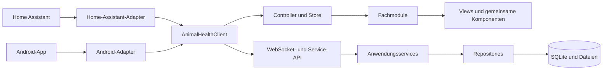
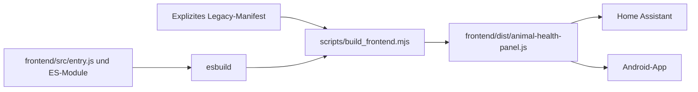

# Animal Health – Zielarchitektur und Migrationsgrenzen

**Status:** Entwurf zur Freigabe  
**Referenzstand:** Animal Health 0.9.41  
**Referenz-Commit:** `4df86bc382b99db3a4276cb451edfacc0eaf502d`  
**Geltungsbereich:** Home-Assistant-Integration, gemeinsames Web-Frontend und eigenständige Android-App

## 1. Zweck

Diese Spezifikation legt die verbindliche Zielarchitektur und die Migrationsgrenzen für die Konsolidierung von Animal Health fest. Sie ersetzt noch keinen Produktivcode. Sie definiert, wie der Funktionsstand von 0.9.41 ohne fachliche Regressionen aus der historischen Frontend-Fragmentkette und den Backend-Runtime-Patches in eine nachvollziehbare, modular testbare Architektur überführt wird.

Die Konsolidierung erfolgt schrittweise. Zu keinem Zeitpunkt darf ein vollständiger Neuaufbau erzwungen werden, der nur als Ganzes ausgeliefert oder geprüft werden kann.

## 2. Ausgangslage

Der aktuelle Stand weist zwei gekoppelte historische Architekturen auf:

1. Das Frontend wird aus 99 nummerierten JavaScript-Dateien lexikografisch zusammengesetzt. Diese Dateien überschreiben wiederholt Methoden derselben globalen Klasse `AnimalHealthPanel`.
2. Das Backend aktiviert beim Start eine lange Folge versionsgebundener Patchfunktionen, die unter anderem Methoden zentraler Klassen wie `TaskRecordStore` ersetzen.

Beide Mechanismen funktionieren derzeit nur aufgrund ihrer impliziten Reihenfolge. Das aktive Verhalten einer Methode ist nicht lokal an ihrer Klassendefinition erkennbar. Dieselben fachlichen Daten werden im Frontend teilweise aus mehreren historischen Zustandscontainern gelesen. Home Assistant und Android verwenden dieselbe zusammengesetzte Oberfläche und sind damit beide an diese Struktur gekoppelt.

Die Grenze von 99 Frontend-Fragmenten ist erreicht. Eine Datei `part100.js` würde lexikografisch zwischen `part10.js` und `part11.js` geladen und zugleich die aktuell hart codierte Android-Prüfung auf 99 Teile brechen.

## 3. Ziele

Die Konsolidierung muss folgende Ergebnisse erreichen:

- Pro fachlicher Funktion existiert genau eine aktuelle Implementierung.
- Frontend-Quellcode ist nach fachlichen Verantwortlichkeiten und nicht nach Releasehistorie gegliedert.
- Das ausgelieferte Frontend bleibt ein einziges selbstenthaltenes Bundle für Home Assistant und Android.
- Die Bundle-Reihenfolge wird durch einen Buildprozess und nicht durch Dateinamen bestimmt.
- Die Benutzeroberfläche greift nur auf einen kanonischen Anwendungszustand und kanonische DTOs zu.
- Navigation, Rendering, Aktionen, Formulare, Übersetzungen und Styles besitzen jeweils eine eindeutige Zuständigkeit.
- Backend-APIs rufen kanonische Anwendungsservices auf; Runtime-Monkey-Patches entfallen.
- Historische Datenbankmigrationen bleiben erhalten, idempotent und getrennt von Runtime-Verhalten.
- Die fachlichen Regeln aus 0.9.41, insbesondere für Serien und einzelne Fälligkeiten, bleiben unverändert.
- Jede Migrationsetappe ist einzeln testbar, auslieferbar und durch Revert rücksetzbar.

## 4. Nichtziele

Die Konsolidierung umfasst ausdrücklich nicht:

- neue fachliche Funktionen,
- ein visuelles Redesign,
- eine Änderung der medizinischen oder dokumentarischen Logik,
- eine Änderung bestehender IDs oder gespeicherter Nutzdaten,
- eine native Neuentwicklung der Android-Oberfläche,
- eine Framework-Migration als Selbstzweck,
- eine neue öffentliche API-Version ohne zwingenden Grund,
- die Entfernung historischer Datenbankmigrationen,
- die gleichzeitige Bereinigung aller Altlasten in einem einzelnen Pull Request.

Funktionsänderungen werden getrennt von Architekturänderungen geplant und umgesetzt.

## 5. Architekturentscheidung

### 5.1 Gewählter Ansatz

Gewählt wird eine **schrittweise Strangler-Migration auf fachliche ES-Module mit einem deterministischen Build und genau einer befristeten Legacy-Brücke**.

Die aktuelle 0.9.41-Oberfläche bleibt zunächst als eingefrorene Legacy-Referenz bestehen. Ein Buildskript erzeugt daraus ein deterministisches Bundle. Neue kanonische Module werden danach nicht als weitere nummerierte Fragmente angelegt, sondern unter `frontend/src/` entwickelt und über einen expliziten Einstiegspunkt gebündelt.

Während der Übergangsphase darf genau eine Datei, `frontend/src/legacy/compatibility-bridge.js`, auf die alte `AnimalHealthPanel`-Klasse zugreifen. Sie delegiert migrierte Routen und Aktionen an neue Module und unmigrierte Bereiche an den eingefrorenen Legacy-Stand. Kein Fachmodul darf selbst den globalen Prototyp verändern.

Nach Migration aller Bereiche wird die Legacy-Brücke zusammen mit den 99 Fragmenten entfernt. Der endgültige Einstiegspunkt definiert die Custom-Element-Klasse direkt.

### 5.2 Technologiewahl

Die Zielarchitektur verwendet:

- modernes JavaScript als ES-Module,
- JSDoc-Typen und statische Prüfung über `checkJs`,
- `scripts/build_frontend.mjs` als einzigen Build-Einstieg,
- zunächst eine dependency-freie Manifestverkettung des eingefrorenen Legacy-Prelude,
- ab dem ersten neuen ES-Modul `esbuild` als fest gepinnte reine Entwicklungsabhängigkeit,
- ein selbstenthaltenes JavaScript-Bundle als Laufzeitartefakt,
- vorhandene Web-Component- und Shadow-DOM-Grundlagen,
- keine neue UI-Framework-Abhängigkeit in der Konsolidierungsphase.

Die Wahl gegen eine sofortige TypeScript- oder Framework-Neuentwicklung reduziert den Umfang der Verhaltensänderung. Typisierung und klare Modulgrenzen werden dennoch verbindlich eingeführt. Eine spätere TypeScript-Konvertierung bleibt möglich, ist aber kein Bestandteil dieser Migration.

### 5.3 Verworfene Ansätze

#### Vollständiger Neuaufbau

Ein Big-Bang-Rewrite würde die implizit gewachsene Fachlogik gleichzeitig neu implementieren. Die vorhandenen Tests decken nicht jede visuelle und interaktive Kombination ab. Das Risiko stiller Funktionsverluste ist daher zu hoch.

#### Zusammenführen in eine einzelne gepflegte Riesendatei

Das reine Zusammenkopieren der 99 Fragmente würde die Dateireihenfolge sichtbar beseitigen, aber weiterhin dieselbe globale Klasse, dieselben Überschreibungsketten und dieselben parallelen Zustände enthalten. Es wäre keine fachliche Konsolidierung.

#### Einführung eines UI-Frameworks während der Migration

Lit, React oder ein anderes Framework könnten langfristig geeignet sein, würden aber zusätzlich zur Architekturänderung das Renderingmodell austauschen. Diese zweite Veränderungsachse wird bewusst vermieden.

## 6. Verbindliche Architekturprinzipien

### 6.1 Eine Quelle pro fachlicher Wahrheit

Jede fachliche Information besitzt genau eine kanonische Quelle im Frontendzustand. Container wie `v0912`, `v0918`, `v0924` oder ähnliche versionsbezogene Zustände dürfen im Zielzustand nicht existieren.

Rohdaten verschiedener bestehender Endpunkte werden an der API-Grenze normalisiert. Fachmodule erhalten nur kanonische DTOs.

### 6.2 Eine Implementierung pro Anwendungsfall

Ein Anwendungsfall wie „Aufgabeninstanz erledigen“, „Tier laden“ oder „Behandlungsplan darstellen“ besitzt genau einen aktuellen Service beziehungsweise Handler. Historische Kompatibilität wird an einem Adapter oder einer Migration gekapselt, nicht durch mehrere nacheinander ausgeführte Implementierungen.

### 6.3 Fachlogik ausserhalb des DOM

Berechnungen zu Status, Fälligkeit, Gruppierung, Zielbereich, Dosisdarstellung, Serien oder Chronikherkunft werden in testbaren Funktionen beziehungsweise Anwendungsservices ausgeführt. DOM-Funktionen formatieren und binden Ergebnisse, entscheiden aber nicht über fachliche Wahrheit.

### 6.4 Explizite Abhängigkeiten

Module importieren ihre Abhängigkeiten. Globale Variablen und zufällig zuvor definierte Konstanten sind unzulässig. Zulässige globale Integrationspunkte sind auf den Custom-Element-Namen und den vom Host bereitgestellten Plattformadapter begrenzt.

### 6.5 Keine stillen Fallback-Ketten

Ein Fachmodul darf nicht mehrere historische Felder oder Container nacheinander durchsuchen, bis ein Wert gefunden wird. Kompatibilitätsübersetzungen erfolgen einmalig im Normalisierer und werden dort mit Tests abgesichert.

### 6.6 Refactoring und Funktionsänderung trennen

Ein Pull Request migriert vorhandenes Verhalten oder ändert vorhandenes Verhalten, niemals beides gleichzeitig. Eine unvermeidbare fachliche Korrektur wird zuerst als eigener Bugfix mit Regressionstest auf dem Referenzstand umgesetzt.


## 7. Laufzeit- und Buildübersicht





## 8. Zielstruktur des Frontends

```text
custom_components/animal_health/frontend/
├── dist/
│   └── animal-health-panel.js
├── legacy/
│   ├── manifest.json
│   └── parts/
│       └── animal-health-panel.part01.js … part99.js
└── src/
    ├── entry.js
    ├── app/
    │   ├── animal-health-panel.js
    │   ├── controller.js
    │   ├── router.js
    │   ├── store.js
    │   └── state.js
    ├── platform/
    │   ├── transport.js
    │   ├── home-assistant-adapter.js
    │   └── android-adapter.js
    ├── api/
    │   ├── client.js
    │   ├── errors.js
    │   ├── normalizers.js
    │   └── contracts.js
    ├── domain/
    │   ├── animals/
    │   ├── timeline/
    │   ├── attachments/
    │   ├── products/
    │   ├── treatments/
    │   ├── tasks/
    │   ├── capture/
    │   ├── settings/
    │   └── ai/
    ├── ui/
    │   ├── components/
    │   ├── forms/
    │   ├── icons/
    │   ├── i18n/
    │   └── styles/
    └── legacy/
        └── compatibility-bridge.js
```

Die konkrete Zahl kleiner Dateien ist nicht normativ. Normativ sind fachliche Verantwortlichkeiten, explizite Imports und eine eindeutige aktuelle Implementierung.

## 9. Frontend-Komponenten

### 9.1 Einstiegspunkt

`entry.js` übernimmt ausschliesslich:

- Ermitteln des Plattformadapters,
- Erzeugen von API-Client, Store und Controller,
- Registrieren des Custom Elements,
- Bereitstellen der Build- und Versionsinformationen.

Es enthält keine fachliche Ansicht und keine Formularlogik.

### 9.2 Panel und Controller

`animal-health-panel.js` verwaltet den Shadow-DOM-Lebenszyklus. Es bindet genau einmal die delegierten Ereignisse `click`, `input`, `change` und `submit`.

`controller.js` übersetzt DOM-Aktionen in explizite Anwendungsaktionen. Die Aktionszuordnung ist eine Map und keine Kette wiederholt überschriebener `handleClick`-Methoden.

Beispielhafte Struktur:

```javascript
const actionHandlers = {
  "animal.open": openAnimal,
  "task.execute": executeTaskOccurrence,
  "attachment.open": openAttachment,
};
```

Jede Aktion besitzt einen stabilen Namen. Fachmodule registrieren Handler über einen definierten Vertrag. Sie verändern keine Methoden des Panels.

### 9.3 Router

Der Router verwaltet interne Routen und Parameter:

```text
overview
animals
animal/:animalId
tasks
calendar
timeline
settings
```

Modale Vorgänge werden separat als Dialogzustand geführt und nicht als versteckte Seitenmutation. Während der Konsolidierung schreibt der Router nicht in `window.history`. Er führt einen eigenen kleinen Navigationsstapel. Die Android-Zurücktaste und interne Home-Assistant-Zurückaktionen rufen denselben `router.back()`-Vertrag auf. Eine spätere Browser-History-Anbindung wäre eine getrennte, host-spezifisch getestete Funktionsänderung.

### 9.4 Store und Zustand

Der Store ist klein und projektspezifisch. Er stellt `getState`, `update` und `subscribe` bereit. Es wird kein allgemeines Redux-ähnliches Framework eingeführt.

Der kanonische Zustand enthält mindestens:

```text
platform
locale
version
navigation
dialog
dashboard
animals
animalDetails
timeline
tasks
catalog
products
treatments
settings
drafts
requests
notifications
```

Jeder Bereich besitzt explizite Zustände für `idle`, `loading`, `ready` und `error`. Asynchrone Antworten tragen eine Request-ID oder einen Kontextschlüssel, damit eine verspätete Antwort nicht den Zustand einer inzwischen gewechselten Tieransicht überschreibt.

### 9.5 Rendering

Es gibt genau einen kontrollierten Renderpfad. Styles werden einmal installiert. Verboten sind:

- `shadowRoot.innerHTML +=`,
- reguläre Ausdrücke zum nachträglichen Umbau bereits erzeugten Markups,
- per Renderdurchlauf neu angehängte globale Styles,
- fachliche Entscheidungen anhand des bereits gerenderten Texts.

Views und Komponenten erzeugen ihr Markup direkt aus Zustand und DTOs. Für umfangreiche interaktive Formulare dürfen gezielte DOM-Updates eingesetzt werden, sofern die Zuständigkeit lokal bleibt.

### 9.6 Gemeinsame UI-Komponenten

Folgende Elemente werden als gemeinsame Komponenten geführt:

- Zielbereich `Gruppe | Tiere | Allgemein`,
- Tier-Mehrfachauswahl,
- Dialograhmen,
- Formularfelder und sichtbare Validierungsfehler,
- Aufgaben- und Fälligkeitszeile,
- Chronikzeile,
- Produkt- und Behandlungsplanauswahl,
- Attachment-Liste und Vorschau,
- Lade-, Leer- und Fehlerzustände,
- Toolbar und Suchfeld.

Fachmodule konfigurieren diese Komponenten über Daten und Callbacks. Sie kopieren deren DOM- oder Zustandslogik nicht.

### 9.7 Übersetzungen

Deutsch und Englisch liegen in je einem vollständigen Wörterbuch. Schlüssel werden nach Fachbereich gruppiert, aber nicht zur Laufzeit über mehrere Versionsdateien erweitert.

CI prüft:

- identische Schlüsselmenge beider Sprachen,
- keine unbenutzten versionsbezogenen Schlüssel in migrierten Bereichen,
- keine direkte Benutzerausgabe nicht lokalisierter Fehlertexte.

### 9.8 Styles

Styles werden in folgende Ebenen getrennt:

1. Home-Assistant-Token und projektspezifische Designvariablen,
2. Grundlayout,
3. wiederverwendbare Komponenten,
4. fachbereichsspezifische Styles,
5. responsive Anpassungen.

Selektoren dürfen nicht auf zufällige DOM-Positionen wie `nth-child` angewiesen sein, wenn eine semantische Klasse möglich ist. Styles werden nicht durch ihre spätere Position als Korrekturmechanismus verwendet.

## 10. Plattform- und API-Grenze

### 10.1 Transportvertrag

Das gemeinsame Frontend kennt Home Assistant und Android nur über einen Transportvertrag:

```javascript
/**
 * @interface
 */
class AnimalHealthTransport {
  request(command, payload) {}
  callService(service, payload, options) {}
  download(resource) {}
  notify(message) {}
}
```

Der Home-Assistant-Adapter verwendet `hass.callWS`, `hass.callService` und die vorhandenen Panelereignisse. Der Android-Adapter verwendet die native Bridge. Fachmodule importieren nie direkt `hass` oder Android-JavaScript-Interfaces.

Während der Übergangsphase darf der Android-Wrapper weiterhin ein kompatibles `hass`-Objekt bereitstellen. Die neue Oberfläche greift jedoch nur über den Adapter darauf zu.

### 10.2 API-Client

Der API-Client bietet fachliche Methoden statt frei zusammengesetzter Command-Strings, beispielsweise:

```text
getDashboard()
getAnimalDetail(animalId)
listTasks(filter)
executeOccurrence(occurrenceId, actual)
listProductDatabases()
saveTreatmentPlan(plan)
```

Bestehende WebSocket-Commands und Services bleiben zunächst unverändert. Der Client kapselt deren aktuelle Namen und Payloadformen.

### 10.3 Normalisierung

`normalizers.js` übersetzt vorhandene Antworten in kanonische DTOs. Dazu gehören:

- einheitliche Stringdarstellung von IDs im Frontend,
- explizite `null`-Werte statt wechselnder fehlender Felder,
- klar getrennte Datums- und Zeitfelder,
- einheitliche Statuswerte,
- einheitliche Herkunftsmetadaten,
- einheitliche Zielart `animal`, `animals`, `group` oder `general`.

Historische Feldnamen werden nur hier ausgewertet. Nach der Normalisierung greifen Views nicht mehr auf alte Aliasfelder zu.

### 10.4 Kanonische DTOs

Die folgenden Kernformen sind verbindlich. Fachbereiche dürfen zusätzliche klar benannte Felder ergänzen.

```javascript
/**
 * @typedef {Object} TargetDto
 * @property {"animal"|"animals"|"group"|"general"} scope
 * @property {string|null} animalId
 * @property {string[]} animalIds
 * @property {string|null} groupId
 * @property {string[]} memberSnapshot
 */

/**
 * @typedef {Object} TaskOccurrenceDto
 * @property {string} id
 * @property {string|null} seriesId
 * @property {string} definitionId
 * @property {TargetDto} target
 * @property {string|null} scheduledAt
 * @property {string|null} dueDate
 * @property {"pending"|"completed"|"skipped"|"cancelled"} status
 * @property {"overdue"|"today"|"upcoming"|"closed"} timing
 * @property {Object} planned
 * @property {Object|null} completion
 */

/**
 * @typedef {Object} HealthEventDto
 * @property {string} id
 * @property {string} animalId
 * @property {string} type
 * @property {string} occurredAt
 * @property {TargetDto|null} target
 * @property {Object|null} source
 * @property {Object} payload
 * @property {Object[]} attachments
 */
```

Datumswerte ohne Uhrzeit werden als `YYYY-MM-DD` behandelt und nicht über eine implizite UTC-Interpretation von `new Date("YYYY-MM-DD")` verschoben. Zeitpunkte sind ISO-8601-Werte mit Offset oder eindeutigem Host-Zeitzonenbezug. Der Backend-Anwendungsservice berechnet `timing`; die UI speichert diesen Wert nicht zurück.

### 10.5 Fehler

Adapter und API-Client ordnen Fehler einem stabilen Fehlercode zu:

```text
validation
not_found
conflict
permission
transport
unavailable
internal
```

Die UI zeigt eine lokalisierte Kurzmeldung. Technische Details bleiben für Diagnose und Logs erhalten. Fehler werden nicht durch stilles Ausweichen auf einen älteren Datencontainer verborgen.

## 11. Fachliche Invarianten

Die Konsolidierung darf folgende Regeln nicht verändern.

### 11.1 Tiere und Gruppen

- Jedes Tier besitzt höchstens eine primäre Tiergruppe.
- Tags bleiben von der primären Tiergruppe getrennt.
- Gruppen sind eigenständige fachliche Ziele.
- Gruppenaktionen speichern `group_id`, Zielart und den damaligen Mitglieder-Snapshot.
- Einzelne Tierchroniken kennzeichnen gruppenweite Aktionen weiterhin als solche.

### 11.2 Chronik

- Chronikeinträge sind ereigniszentriert.
- Herkunft aus einer Aufgabe ist sekundäre Metainformation und ändert nicht die fachliche Grunddarstellung.
- Korrekturen überschreiben bestehende Ereignisse nicht.
- Anhänge bleiben mit dem konkreten Tier und gegebenenfalls dem konkreten Ereignis verknüpft.

### 11.3 Aufgaben und Serien

- Serienvorlage und einzelne Fälligkeit sind getrennte Objekte.
- Jede Fälligkeit besitzt eine eigene unveränderliche ID, `series_id`, geplante Zeit und Status.
- Eine offene Instanz bleibt beim Tageswechsel bestehen.
- Die nächste Instanz wird zusätzlich erzeugt.
- „Überfällig“ wird nicht dauerhaft gespeichert, sondern aus offenem Status und überschrittener Fälligkeit in der Home-Assistant-Zeitzone abgeleitet.
- Aktionen adressieren immer die konkrete Aufgabeninstanz.
- Das Erledigen einer älteren Instanz verändert keine andere Instanz derselben Serie.
- Offline-Lücken werden ohne Löschen vorhandener Instanzen materialisiert.
- Routinen ohne Dokumentationspflicht erzeugen keinen künstlichen Überfälligkeitsstau.
- Die konservative 0.9.41-Bestandskorrektur bleibt idempotent.

### 11.4 Medizinische Erfassung

- Die KI erzeugt nur zu prüfende Vorbefüllungen.
- Die KI stellt keine Diagnose, empfiehlt keine Therapie und berechnet keine Dosis.
- Speicherung erfolgt erst durch eine ausdrückliche Benutzeraktion.
- Produktquelle, lokaler Override und erfasste Durchführung bleiben voneinander unterscheidbar.

## 12. Zielstruktur des Backends

```text
custom_components/animal_health/
├── __init__.py
├── runtime.py
├── api/
│   ├── dashboard.py
│   ├── animals.py
│   ├── timeline.py
│   ├── attachments.py
│   ├── products.py
│   ├── treatments.py
│   ├── tasks.py
│   ├── settings.py
│   └── ai.py
├── application/
│   ├── animal_service.py
│   ├── timeline_service.py
│   ├── attachment_service.py
│   ├── product_service.py
│   ├── treatment_service.py
│   ├── task_definition_service.py
│   ├── task_occurrence_service.py
│   └── task_execution_service.py
├── domain/
│   ├── models.py
│   ├── task_recurrence.py
│   ├── task_policy.py
│   ├── treatment.py
│   └── errors.py
├── infrastructure/
│   ├── database.py
│   ├── repositories/
│   ├── exports/
│   └── media/
└── migrations/
    ├── v0916.py
    ├── v0927.py
    ├── v0941.py
    └── ...
```

Die Struktur ist ein Zielbild. Dateien werden nur verschoben, wenn der betreffende Anwendungsfall vollständig auf den neuen Pfad umgestellt und getestet ist.

### 12.1 Anwendungsservices

Home-Assistant-Services, WebSocket-Handler und Android-Endpunkte enthalten keine eigene Fachlogik. Sie validieren Eingaben, rufen einen Anwendungsservice auf und serialisieren das Ergebnis.

`TaskRecordStore.execute` wird im Zielzustand nicht mehr durch mehrere Module ersetzt. Die Ausführung liegt in einem `TaskExecutionService`, der Transaktion, Chronikerzeugung, Herkunftsmetadaten, Behandlungsplanbestandteile und Statuswechsel vollständig steuert.

### 12.2 Repositories

SQL-Zugriffe werden fachlich gebündelt. Ein Repository stellt Datenzugriff bereit, entscheidet aber nicht über fachliche Abläufe. Transaktionsgrenzen werden vom Anwendungsservice gesetzt.

### 12.3 Migrationen

Historische Schema- und Datenmigrationen bleiben versioniert. Sie dürfen frühere Datenstände erkennen und idempotent aktualisieren.

Nicht als Migration gelten:

- das Ersetzen einer laufenden Klassenmethode,
- das Registrieren eines alternativen Runtime-Handlers,
- das Patchen eines aktiven Services nach Import.

Solche Runtime-Patches werden in kanonische Implementierungen überführt und danach entfernt.

## 13. Übergangsarchitektur

### 13.1 Eingefrorener Legacy-Stand

Die 99 Frontend-Fragmente werden zunächst an ihrem bestehenden Ort eingefroren und in `frontend/legacy/manifest.json` vollständig und in exakter Reihenfolge aufgeführt. Erst nachdem Home Assistant, Android und alle Tests ausschliesslich das Dist-Bundle verwenden, dürfen sie in einem separaten reinen Rename-PR nach `frontend/legacy/parts/` verschoben werden. Während der Migration dürfen diese Dateien nur für einen kritischen, separat getesteten Bugfix geändert werden.

Neue nummerierte Fragmente sind verboten.

### 13.2 Deterministisches Bundle

`scripts/build_frontend.mjs` erzeugt `frontend/dist/animal-health-panel.js` aus:

1. dem explizit geordneten Legacy-Prelude,
2. dem mit `esbuild` als IIFE gebündelten modernen Einstiegspunkt,
3. Buildmetadaten und Quellhash.

In Phase 1 enthält der moderne Teil noch keine aktive Funktion; das Skript verkettet nur das explizite Manifest und benötigt keine externe Abhängigkeit. `esbuild` wird erst mit dem ersten echten ES-Modul eingeführt. Nach Entfernung des Legacy-Prelude erzeugt dasselbe Skript nur noch das moderne Bundle.

Das Bundle wird im Repository mitgeführt, weil HACS-Installationen keine Node-Buildumgebung voraussetzen dürfen. CI baut das Bundle neu und schlägt fehl, wenn das Ergebnis vom eingecheckten Artefakt abweicht.

Home Assistant liefert nur das Dist-Bundle aus. Android kopiert dasselbe Dist-Bundle. Kein Host sortiert oder verkettet zur Laufzeit Quelldateien.

### 13.3 Eine Legacy-Brücke

Nur `compatibility-bridge.js` darf:

- die vorhandene Legacy-Klasse referenzieren,
- ausgewählte Routen an neue Module delegieren,
- die verbleibenden Legacy-Handler aufrufen,
- den Migrationsstatus eines Bereichs festlegen.

Die Brücke darf keine neue Fachlogik enthalten. Ihre Grösse und die Zahl der Legacy-Delegationen müssen mit jeder abgeschlossenen Migrationsetappe sinken.

### 13.4 Rücksetzbarer Wechsel pro Bereich

Eine Route oder ein Anwendungsfall wird erst auf die neue Implementierung geschaltet, wenn seine Charakterisierungs-, Vertrags- und Browsertests bestanden sind. Der Wechsel erfolgt in einem kleinen Registry-Eintrag. Ein Revert dieses Commits stellt den Legacy-Pfad wieder her, ohne Daten zurückmigrieren zu müssen.

Es gibt keine parallelen Schreibpfade und keine duale Persistenz.

## 14. Migrationsreihenfolge

### Phase 0 – Referenzstand und Schutzregeln

**Zweck:** 0.9.41 als überprüfbare Referenz einfrieren.

**Umfang:**

- vollständige Inventarliste der 99 Fragmente,
- Inventar aller Frontend-Prototypüberschreibungen,
- Inventar aller Backend-Runtime-Patches,
- Charakterisierung zentraler Benutzerabläufe,
- CI-Regel gegen `part100.js` und weitere nummerierte Fragmente,
- CI-Regel gegen neue direkte Prototyp-Patches ausserhalb der Legacy-Brücke,
- CI-Regel gegen neue Runtime-Methodenzuweisungen in `vXXXX`-Modulen,
- dokumentierte Basisszenarien für Home Assistant und Android.

**Austrittskriterium:** Der Referenzstand lässt sich reproduzierbar bauen, und jede Erweiterung der Altarchitektur führt zu einem CI-Fehler.

### Phase 1 – Build- und Auslieferungsgrenze

**Zweck:** Dateisortierung und Laufzeitverkettung beseitigen, ohne Verhalten zu ändern.

**Umfang:**

- explizites Legacy-Manifest für die bestehenden Dateipfade,
- reproduzierbares Dist-Bundle,
- `panel.py` liefert das Dist-Bundle,
- Android übernimmt dasselbe Dist-Bundle,
- Validate- und Android-Workflow prüfen die Bundle-Aktualität,
- Bundle-Hash bleibt Bestandteil der Cache-Busting-URL.

**Austrittskriterium:** Home Assistant und Android verwenden bytegleich dasselbe Artefakt; die 99 Quelldateien werden nur noch vom Buildskript gelesen.

### Phase 2 – Plattformadapter und API-Normalisierung

**Zweck:** Host- und Datenzugriff von der UI lösen.

**Umfang:**

- Transportinterface,
- Home-Assistant- und Android-Adapter,
- fachlicher API-Client,
- kanonische Fehler,
- Normalisierer für Dashboard, Tiere, Chronik, Aufgaben, Produkte und Einstellungen,
- Vertragsfixtures aus realistischen 0.9.41-Antworten.

**Austrittskriterium:** Neue Module greifen weder direkt auf `hass` noch auf historische Zustandscontainer zu.

### Phase 3 – Anwendungsshell und gemeinsame Infrastruktur

**Zweck:** einen einzigen kontrollierten UI-Lebenszyklus etablieren.

**Umfang:**

- Store,
- Router,
- Dialogzustand,
- Benachrichtigungen,
- Lade- und Fehlerzustände,
- gemeinsame Styles,
- zentrale Übersetzungswörterbücher,
- Aktionsregistry,
- gemeinsamer Zielbereichs- und Tierauswahlzustand.

**Austrittskriterium:** Navigation, Dialoge und globale Ereignisbehandlung besitzen eine aktuelle Implementierung und keine Wrapperkette.

### Phase 4 – Lesende Tier- und Chronikansichten

**Zweck:** zuerst risikoarme, gut vergleichbare Ansichten migrieren.

**Reihenfolge:**

1. Übersicht,
2. Tierliste und Gruppenfilter,
3. Tierdetail-Grunddaten,
4. Chronikliste,
5. Chronikdetails,
6. Kalenderdarstellung.

**Austrittskriterium:** Alle lesenden Hauptansichten verwenden kanonische DTOs und neue Komponenten. Keine migrierte Ansicht liest Legacy-Zustände.

### Phase 5 – Gemeinsame Formulare, Erfassungen und Anhänge

**Zweck:** wiederverwendbare Schreib- und Dateiflüsse konsolidieren.

**Reihenfolge:**

1. Tier anlegen und bearbeiten,
2. Status ändern,
3. Gewicht,
4. Symptom,
5. allgemeiner Chronikeintrag,
6. Zielbereich und Mehrfachauswahl,
7. Attachment-Auswahl, Upload, Vorschau, Download und Löschen.

**Austrittskriterium:** Diese Schreibpfade verwenden einen gemeinsamen Formular- und Fehlervertrag; keine HTML-Nachbearbeitung per regulärem Ausdruck bleibt erforderlich.

### Phase 6 – Produkte, Gaben und Behandlungspläne

**Zweck:** Produktquellen und dokumentierte Durchführung auf eine kanonische Struktur bringen.

**Reihenfolge:**

1. Produktdatenbanken und lokale Overrides,
2. Medikamente,
3. Impfstoffe,
4. Entwurmungen,
5. Ergänzungen und Futtermittel,
6. direkte Gabe,
7. Behandlungen und Behandlungspläne,
8. Chronikdarstellung der erzeugten Ereignisse.

**Austrittskriterium:** Ein Produkt, ein Behandlungsplan und ein Durchführungssnapshot besitzen je ein kanonisches DTO. Direkte und aus Aufgaben entstandene Einträge teilen dieselbe Darstellungslogik.

### Phase 7 – Aufgaben und Serien

**Zweck:** den komplexesten Fachbereich erst nach Stabilisierung der gemeinsamen Grundlagen migrieren.

**Reihenfolge:**

1. Aufgabendefinition,
2. Serienvorlage,
3. Fälligkeitsmaterialisierung,
4. Gruppierung `Überfällig | Heute | Demnächst`,
5. Aufgabenübersicht und Tierdialog,
6. Duplizieren und erneutes Planen,
7. Ausführung einer konkreten Instanz,
8. Überspringen und Abbrechen,
9. Chronikerzeugung,
10. Offline-Lücken und 0.9.41-Bestandskorrektur.

Frontend und Backend werden hier als vertikale Teilstücke migriert. Eine neue Aufgabenansicht darf nicht auf mehrere alte Backend-Ausführungspfade zeigen.

**Austrittskriterium:** `TaskExecutionService` ist die einzige aktuelle Ausführungslogik; Serien und Instanzen erfüllen alle Invarianten aus Abschnitt 11.3.

### Phase 8 – Einstellungen, Administration und KI

**Zweck:** verbleibende querschnittliche Funktionen migrieren.

**Reihenfolge:**

1. dreistufige Einstellungsnavigation,
2. Stammdaten- und Produktkonfiguration,
3. Export, Backup und Diagnose,
4. getrennte destruktive Rücksetzungen,
5. KI-Konfiguration,
6. KI-Einzelerfassung,
7. KI-Mehrfacherfassung und Prüfstatus.

**Austrittskriterium:** Einstellungen und KI verwenden denselben Store, API-Client und Formularvertrag wie die übrige Anwendung.

### Phase 9 – Backend-Flattening und Entfernung der Legacy-Laufzeit

**Zweck:** verbleibende historische Runtime-Schichten vollständig beseitigen.

**Umfang:**

- direkte Registrierung kanonischer APIs und Services,
- Entfernen von `_apply_all_patches`,
- Entfernen überführter `vXXXX_features.py`- und `vXXXX_patches.py`-Runtime-Module,
- Erhalt echter Migrationen unter `migrations/`,
- Entfernen der Frontend-Legacy-Brücke,
- Entfernen der 99 Fragmente,
- Entfernen von Tests, die nur alte Dateinamen statt Verhalten absichern,
- Aktualisieren von README und Architekturdokumentation.

**Austrittskriterium:** Das laufende System benötigt keine historische Patchreihenfolge. Der aktuelle Funktionsstand lässt sich aus den kanonischen Modulen und Migrationen vollständig erklären.

## 15. Pull-Request-Grenzen

Jeder Migrations-Pull-Request erfüllt folgende Regeln:

- ein klar abgegrenzter Anwendungsfall oder eine Infrastrukturgrenze,
- keine neue Funktion,
- keine Datenbankänderung, sofern sie nicht Gegenstand eines getrennten Migrations-PR ist,
- keine gleichzeitige visuelle Neugestaltung,
- vollständige Tests des migrierten Verhaltens,
- unveränderte öffentliche Command- und Serviceverträge, sofern kein eigener Kompatibilitätsplan vorliegt,
- kein neuer nummerierter Frontend-Teil,
- kein neuer Backend-Runtime-Patch,
- Dist-Bundle reproduzierbar,
- Home-Assistant-Validierung erfolgreich,
- Android-Build erfolgreich,
- dokumentierter Revert-Punkt.

Ein PR darf alte Dateien erst löschen, nachdem alle enthaltenen Anwendungsfälle nachweislich überführt wurden.

## 16. Teststrategie

### 16.1 Charakterisierungstests

Vor jeder Extraktion werden die beobachtbaren Ergebnisse des bestehenden 0.9.41-Pfads beschrieben. Charakterisierungstests sichern Verhalten, nicht interne Methodennamen.

### 16.2 JavaScript-Unit-Tests

Pure Normalisierer, Selektoren, Fälligkeitsgruppierung, Zielbereichslogik, Formularvalidierung und Formatierung werden ohne Browser getestet. Der eingebaute Node-Testläufer genügt; ein zusätzliches Testframework ist nicht erforderlich.

### 16.3 API-Vertragstests

Fixtures prüfen, dass bestehende Home-Assistant- und Android-Antworten in dasselbe kanonische DTO überführt werden. Aliasfelder dürfen nur im Normalisierer vorkommen.

### 16.4 Browsertests

Ein kleiner Playwright-Smoke-Test lädt das gebaute Bundle in einem Mock-Host und prüft mindestens:

- Start und Laden,
- Navigation,
- Öffnen und Schliessen eines Dialogs,
- Tierdetail,
- Aufgabe öffnen,
- konkrete Fälligkeit ausführen,
- Attachment-Vorschau,
- Deutsch und Englisch,
- schmale und breite Darstellung.

Primäres Kriterium sind Interaktion und sichtbare Inhalte. Vollständige HTML-Snapshots sind nicht die Hauptabsicherung.

### 16.5 Backend-Tests

Anwendungsservices werden mit temporärer SQLite-Datenbank getestet. Aufgaben- und Chronikschreibvorgänge prüfen Transaktionsatomarität. Migrationstests decken repräsentative ältere Datenstände und wiederholte Ausführung ab.

### 16.6 Plattformmatrix

Vor Entfernen eines Legacy-Bereichs werden mindestens geprüft:

- Home Assistant Desktop,
- Home Assistant schmale Ansicht beziehungsweise Android-WebView,
- eigenständige Android-App,
- Deutsch und Englisch,
- heller und dunkler Home-Assistant-Modus,
- leerer und gefüllter Datenbestand,
- Fehler beim Laden und erneutes Laden.

## 17. CI-Schutzregeln

Während der Migration gelten automatisierte Architekturprüfungen:

```text
keine neue animal-health-panel.part*.js
kein shadowRoot.innerHTML +=
kein Prototype-Patch ausser compatibility-bridge.js
keine Zuweisung TaskRecordStore.<methode> = ...
keine neue apply_vXXXX_patches-Registrierung
keine Verwendung v09xx-Zustandscontainer in frontend/src
Dist-Bundle entspricht dem Build
Deutsch und Englisch besitzen dieselben Schlüssel
Home-Assistant- und Android-Build verwenden dasselbe Bundle
```

Bestehende Altdateien können vorübergehend gegen einzelne Regeln ausgenommen werden. Die Ausnahmeliste ist explizit und darf nur kleiner werden.

## 18. Versions- und Releasepolitik während der Migration

- 0.9.41 bleibt die fachliche Referenz.
- Architektur-PRs erhöhen die Produktversion nur, wenn sie tatsächlich veröffentlicht werden.
- Ein Release enthält nur abgeschlossene und vollständig umgeschaltete Migrationsetappen.
- Unfertige neue Module bleiben ohne aktive Route und beeinflussen das Bundleverhalten nicht.
- Release Notes unterscheiden klar zwischen interner Konsolidierung und sichtbaren Funktionsänderungen.
- Der gemeinsame Frontend-Build trägt die Integrationsversion; die Android-App behält ihre eigene App-Version.
- Eine Änderung des gemeinsamen Frontends löst den Android-CI-Build aus.

## 19. Risiken und Gegenmassnahmen

### Verborgener Funktionsverlust

**Risiko:** Eine ältere Prototypschicht enthält Verhalten, das in der sichtbaren Endmethode nicht auffällt.  
**Gegenmassnahme:** Methoden- und Aktionsinventar, Charakterisierungstests und vertikale Migration kleiner Bereiche.

### Visuelle Regression

**Risiko:** CSS-Korrekturen beruhen bisher auf Reihenfolge.  
**Gegenmassnahme:** semantische Style-Ebenen, Browsermatrix und gezielte visuelle Referenzen kritischer Ansichten.

### Android-Abweichung

**Risiko:** Home Assistant und Android bauen unterschiedliche Artefakte.  
**Gegenmassnahme:** ein eingechecktes Dist-Bundle als einzige Quelle für beide Hosts.

### Dauerhafte Legacy-Brücke

**Risiko:** Die Übergangsschicht wird zur neuen Patchplattform.  
**Gegenmassnahme:** nur eine erlaubte Brücke, keine Fachlogik darin, messbar sinkende Delegationsliste und festes Entfernungskriterium.

### Aufgabenregression

**Risiko:** Serien, Fälligkeiten und Chronikerzeugung besitzen die höchste fachliche Kopplung.  
**Gegenmassnahme:** Aufgaben erst nach API-, Store-, Formular-, Produkt- und Chronikgrundlagen migrieren; 0.9.41-Invarianten als eigenständige Vertragstests.

### Release ohne reproduzierbares Bundle

**Risiko:** eingechecktes Dist-Artefakt ist veraltet.  
**Gegenmassnahme:** CI baut neu und vergleicht bytegenau vor jedem Merge und Release.

## 20. Definition of Done

Die Konsolidierung ist abgeschlossen, wenn alle folgenden Bedingungen erfüllt sind:

- `frontend/dist/animal-health-panel.js` wird aus fachlichen ES-Modulen gebaut.
- Home Assistant und Android verwenden dasselbe Bundle.
- Es existieren keine aktiven nummerierten Frontend-Fragmente.
- Es existiert keine Frontend-Prototyp-Patchkette.
- Es gibt genau einen kontrollierten Render-, Aktions- und Formularpfad.
- Fachmodule verwenden ausschliesslich kanonische DTOs.
- Es existieren keine versionsbezogenen Frontend-Zustandscontainer.
- Backend-APIs rufen kanonische Anwendungsservices auf.
- `_apply_all_patches` und Runtime-Methodenersetzungen sind entfernt.
- Historische Datenbankmigrationen bleiben erhalten und getestet.
- Alle fachlichen Invarianten aus 0.9.41 sind durch Regressionstests abgesichert.
- Home-Assistant- und Android-CI sind erfolgreich.
- README, Installationsdokumentation und Architekturübersicht entsprechen dem tatsächlichen Stand.

## 21. Erste umzusetzende Etappe nach Freigabe

Die erste Implementierungsetappe umfasst ausschliesslich **Phase 0 und Phase 1**:

1. Architektur-Schutztests,
2. explizites Legacy-Manifest,
3. deterministisches Buildskript,
4. eingechecktes Dist-Bundle,
5. Umstellung von `panel.py` auf das Dist-Bundle,
6. Umstellung des Android-Builds auf dasselbe Artefakt,
7. Erweiterung des Android-Workflow-Pfadfilters um das gemeinsame Frontend,
8. CI-Prüfung der Reproduzierbarkeit.

Diese Etappe verändert keine fachliche Ansicht, keine API, keine Datenbank und keinen Benutzerablauf. Sie beseitigt zuerst die unmittelbare `part100`-Grenze und schafft die sichere Grundlage für jede weitere Extraktion.
